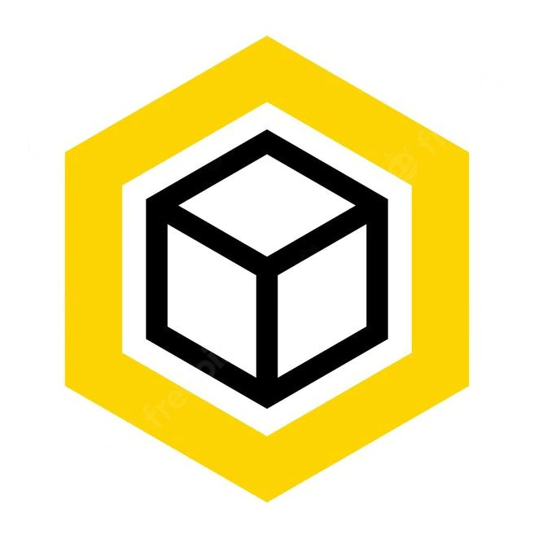

<!-- REFERENCES -->
[Pandas]: https://img.shields.io/badge/pandas-FFFFFF?style=for-the-badge&logo=pandas&logoColor=blue
[Openpyxl]: https://img.shields.io/badge/openpyxl-5A45FF?style=for-the-badge&logo=openbadges&logoColor=white

[![LinkedIn][linkedin-shield]](https://www.linkedin.com/in/andres-bruges-776382126/)

<!-- PROJECT LOGO -->
<br />
<div align="center">
  <a>
    
  </a>

<h3 align="center">Line Packaging Organizer v3.0</h3>

  <p align="center">
    Automated reports for efficient logistics
    <br />
    <a href="https://github.com/abruges/Line-packaging-organizer-v3.0"><strong>Explore the docs »</strong></a>
    <br />

  </p>
</div>


<!-- ABOUT THE PROJECT -->
## About The Project

This project was designed to optimize packaging logistics transitioning from a
single box approach to a single product / products model, which is the best method to use when 
the logistic workflow requires handling multiple products for multiple orders.
<br />
<br />
The software uses Quickbook reports, that need to be downloaded locally, as data source. Future 
versions will include a direct Quickbooks API solution using the OAUTH 2.0 protocol.

<p align="right">(<a href="#readme-top">back to top</a>)</p>


### Built With

* [![Pandas][Pandas]](https://pandas.pydata.org/)
* [![Openpyxl][Openpyxl]](https://openpyxl.readthedocs.io/en/stable/)

<p align="right">(<a href="#readme-top">back to top</a>)</p>


<!-- GETTING STARTED -->
## Getting Started

This is an example of how you may give instructions on setting up your project locally.
To get a local copy up and running follow these simple example steps.

### Prerequisites

This is an example of how to list things you need to use the software and how to install them.
* npm
  ```sh
  npm install npm@latest -g
  ```

### Installation

1. Get a free API Key at [https://example.com](https://example.com)
2. Clone the repo
   ```sh
   git clone https://github.com/github_username/repo_name.git
   ```
3. Install NPM packages
   ```sh
   npm install
   ```
4. Enter your API in `config.js`
   ```js
   const API_KEY = 'ENTER YOUR API';
   ```

<p align="right">(<a href="#readme-top">back to top</a>)</p>


